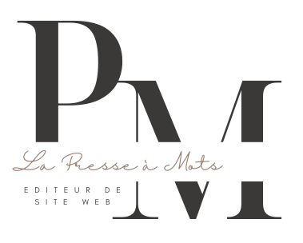

[![Contributors][contributors-shield]][contributors-url]
[![Forks][forks-shield]][forks-url]
[![Stargazers][stars-shield]][stars-url]
[![Issues][issues-shield]][issues-url]
[![LinkedIn][linkedin-shield]][linkedin-url]

  

     
    <a href="https://github.com/LaureZammit/CMS-php">Voir les documents</a>
    &nbsp;
    ·
    &nbsp;
    <a href="https://github.com/LaureZammit/CMS-php/issues">Rapporter une erreur</a>

# LES OBJECTIFS DU PROJET - CMS en PHP

## Détail du projet

Vous allez développer un système d’administration. Vous pouvez voir ce projet comme une version minimaliste de WordPress. Pour ce projet vous devrez gérer :

* [ ] Côté administration :
    * [x] Connexion à l’administration
        * [x] Redirection sur la page d’accueil si le privilège n’est pas le bon

    * [ ] Création de pages
        * [ ] Titre
        * [ ] Image mise en avant
        * [ ] Contenu de la page
        * [ ] Date de publication
        * [ ] Statut de publication
            * [ ] Publié
            * [ ] En attente de relecture
            * [ ] Brouillon
    * [ ] Modification de pages
    * [ ] Suppression de pages

    * [ ] Création d'articles
        * [ ] Titre
        * [ ] Image mise en avant
        * [ ] Contenu de la page
        * [ ] Date de publication
        * [ ] Statut de publication
            * [ ] Publié
            * [ ] En attente de relecture
            * [ ] Brouillon
    * [ ] Modification d'articles
    * [ ] Suppression d'articles
    * [ ] Création de catégories d'article
    * [ ] Modification de catégories d'article
    * [ ] Suppression de catégories d'article

    * [ ] Création de comptes
        * [x] Nom
        * [x] Prénom
        * [x] Mail
        * [x] Pseudo
        * [x] Mot de passe
        * [ ] Avatar
        * [ ] Niveau de compte
            * [ ] Administrateur
                * [ ] Tous les droits
            * [ ] Modérateur
                * [ ] Gestion des articles et des pages
            * [ ] Membre
                * [ ] Gestion de son compte (ajout d'avatar, modification MDP)
    * [ ] Modification de comptes
    * [ ] Suppression de comptes

* [ ] Côté utilisateur
    * [x] Affichage de la page d'accueil
    * [ ] Affichage des pages créées
    * [ ] Affichage du (listing) des articles
    * [ ] Affichage d'un article en particulier
    * [x] Inscription utilisateur
    * [x] Connexion utilisateur
    * [ ] Modification profil utilisateur
    * [x] Déconnexion

Il faut organiser correctement votre code, son indentation, les commentaires et le nom des fichiers afin de ne pas vous perdre dans ce projet.

Nous travaillerons toujours étape par étape en commençant quand c’est possible, par le code HTML.

Après chaque implémentation de nouvelles fonctionnalités, il faut toujours tester l’ensemble du système afin de s’assurer qu’une nouvelle fonctionnalité ne vienne pas casser une fonctionnalité déjà présente (régression).

Vous travaillerez en mode professionnel, ce qui signifie que vous allez devoir créer un repository Github pour ce projet. Vous devrez faire vos commit régulièrement en y attribuant un titre correct et une description.

## Construction

 

## Auteure

Laure Zammit

## Contact

Laure Zammit - laurezammit@gmail.com

Project Link: [https://github.com/LaureZammit/CMS-php.git](https://github.com/LaureZammit/CMS-php.git)

## Remerciements

* [Jean-Louis ERRANTE](https://www.errantecreation.com/) : formateur

* [PurpleBooth](https://github.com/PurpleBooth/a-good-readme-template) : modèle de Readme très complet
* [Othneildrew](https://github.com/othneildrew/Best-README-Template/blob/master/README.md) - Readme Template

<!-- MARKDOWN LINKS & IMAGES -->
<!-- https://www.markdownguide.org/basic-syntax/#reference-style-links -->
[contributors-shield]: https://img.shields.io/github/contributors/LaureZammit/CMS-php.svg?style=for-the-badge
[contributors-url]: https://github.com/LaureZammit/CMS-php/graphs/contributors
[forks-shield]: https://img.shields.io/github/forks/LaureZammit/CMS-php.svg?style=for-the-badge
[forks-url]: https://github.com/LaureZammit/CMS-php/forks
[stars-shield]: https://img.shields.io/github/stars/LaureZammit/CMS-php.svg?style=for-the-badge
[stars-url]: https://github.com/LaureZammit/CMS-php/stargazers
[issues-shield]: https://img.shields.io/github/issues/LaureZammit/CMS-php.svg?style=for-the-badge
[issues-url]: https://github.com/LaureZammit/CMS-php/issues

[linkedin-shield]: https://img.shields.io/badge/-LinkedIn-black.svg?style=for-the-badge&logo=linkedin&colorB=555
[linkedin-url]: https://www.linkedin.com/in/laure-zammit-84a3b3150/